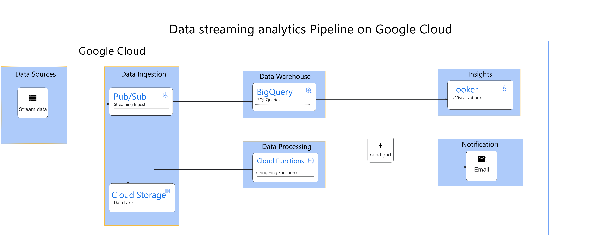

# Building IoT Sensor Data Processing on Google Cloud Platform
This repository contains the setup and code for handling IoT sensor data using various Google Cloud Platform (GCP) services and third-party integrations.


## Appendix

We've implemented a robust system for processing IoT sensor data, utilizing GCP services like:
Google Cloud Engine (GCE) for hosting VM instances to generate simulated IoT sensor data.
Pub/Sub for managing the messaging between various components.
Cloud Storage for storing IoT data for long-term analysis.
BigQuery for analyzing and querying the IoT data.
Cloud Functions for triggering specific actions based on data thresholds.
Looker Studio for creating visual dashboards and conducting in-depth analysis.
SendGrid as a third-party service for sending email notifications.


## Installation

Installation of this packages are required

```bash
  pip install google-cloud-pubsub
  pip install sendgrid
```
    
## Architecture



### Data Generation
Google Cloud Engine (GCE) hosts VM instances to simulate IoT sensor data.
### Data Collection and Processing
Pub/Sub acts as a messaging service, collecting data from the simulated IoT sensors.
Multiple subscriptions to Pub/Sub are linked to various services:
BigQuery for data analysis and querying.
Cloud Functions to trigger actions based on predefined thresholds.
Cloud Storage for long-term storage of the collected IoT data.
### Analysis and Visualization
BigQuery enables data analysis and querying capabilities for detailed insights.
Looker Studio creates visual dashboards for in-depth analysis and visualization of the processed data.
### Notifications
Cloud Functions are utilized to trigger email notifications through SendGrid when certain thresholds are exceeded.

## Deployment steps

### Google Cloud Platform Setup
Ensure you have access to GCP services like GCE, Pub/Sub, BigQuery, Cloud Functions, Cloud Storage, and Looker Studio.
### Configuration
Set up Pub/Sub topics and subscriptions for data ingestion.
Configure Cloud Functions for threshold-based triggers and email notifications using SendGrid API.
### Data Processing
Deploy code to GCE instances to generate simulated IoT sensor data.
Create necessary connections between Pub/Sub, BigQuery, Cloud Functions, and Cloud Storage.
### Analysis and Visualization
Use BigQuery for querying and analyzing data.
Utilize Looker Studio to create dashboards for visual representation.
### Notifications
Cloud Functions should be configured to send email notifications via SendGrid when threshold limits are surpassed.


## Conclusion
This comprehensive workflow demonstrates a robust system for managing real-time IoT sensor data within the Google Cloud Platform. By leveraging the power of Pub/Sub, BigQuery, Dataflow, Cloud Functions, and Cloud Storage, a seamless and efficient pipeline is established to handle data ingestion, visualization, transformations, threshold-based alerting, and long-term archiving, allowing organizations to effectively manage and derive valuable insights from their IoT data streams in real-time.

## Documentation
[Google Cloud Pub/Sub documentation](https://cloud.google.com/pubsub/docs)

[Google Cloud BigQuery documentation](https://cloud.google.com/bigquery)

[Google Cloud Dataflow documentation](https://cloud.google.com/dataflow)

[Google Cloud Functions documentation](https://cloud.google.com/functions)

[Google Cloud Storage documentation](https://cloud.google.com/products/storage)

####
Please note that this is a general outline, and specific implementation details may vary depending on your specific needs and requirements.


